---
# Wazuh SIEM configuration
## Configuring the Wazuh SIEM on a Linux Server and agents
### Installing the Wazuh manager
#### curling the install script and running it
`curl -sO https://packages.wazuh.com/4.9/wazuh-install.sh && sudo bash ./wazuh-install.sh -a`

```bash
wazuh@server-machine:~$ sudo apt update
Hit:1 http://eg.archive.ubuntu.com/ubuntu jammy InRelease
Hit:2 http://eg.archive.ubuntu.com/ubuntu jammy-updates InRelease
Hit:3 http://eg.archive.ubuntu.com/ubuntu jammy-backports InRelease
Hit:4 http://security.ubuntu.com/ubuntu jammy-security InRelease
Reading package lists... Done
Building dependency tree... Done
Reading state information... Done
296 packages can be upgraded. Run 'apt list --upgradable' to see them.
-----------------------------------------------------
Then we run a curl command to grab the installer shell file and run it with sudo 

wazuh@server-machine:~$ curl -sO https://packages.wazuh.com/4.9/wazuh-install.sh && sudo bash ./wazuh-install.sh -a

13/09/2024 02:06:06 INFO: Starting Wazuh installation assistant. Wazuh version: 4.9.0

13/09/2024 02:07:32 INFO: --- Wazuh indexer ---
13/09/2024 02:07:32 INFO: Starting Wazuh indexer installation.
13/09/2024 02:11:54 INFO: Wazuh indexer installation finished.
13/09/2024 02:11:54 INFO: Wazuh indexer post-install configuration finished.

13/09/2024 02:12:15 INFO: --- Wazuh server ---
13/09/2024 02:12:15 INFO: Starting the Wazuh manager installation.
13/09/2024 02:15:36 INFO: Wazuh manager installation finished.
13/09/2024 02:15:36 INFO: Wazuh manager vulnerability detection configuration finished.

13/09/2024 02:18:33 INFO: --- Wazuh dashboard ---
13/09/2024 02:18:34 INFO: Starting Wazuh dashboard installation.
13/09/2024 02:22:01 INFO: Wazuh dashboard installation finished.
13/09/2024 02:22:02 INFO: Wazuh dashboard post-install configuration finished.

13/09/2024 02:25:36 INFO: --- Summary ---
13/09/2024 02:25:36 INFO: You can access the web interface https://localhost:443
    User: admin
    Password: ******************

13/09/2024 02:25:47 INFO: Installation finished.

```


---
### Installing the Wazuh agent on a test machine

Our test agent machine will be a windows machine.
1. Install the Wazuh agent software on the windows machine
2. Set up the connection with the Wazuh server and starting the service
#### Installing the Wazuh agent
1. First we will need to download the [Windows installer](https://packages.wazuh.com/4.x/windows/wazuh-agent-4.9.0-1.msi).

2. Following the Wazuh documentation we simply run the [Windows installer](https://packages.wazuh.com/4.x/windows/wazuh-agent-4.9.0-1.msi), then select a configuration method(CLI/GUI)(Both methods need administrator privilege's).
	- CLI method.
		Using CMD
		`wazuh-agent-4.9.0-1.msi /q WAZUH_MANAGER="192.168.64.134"`
		Or powershell
		`.\wazuh-agent-4.9.0-1.msi /q WAZUH_MANAGER="192.168.64.134"`
		Then after Installing Wazuh with either of the commands we run the service with the following respectively, In CMD we use
		`NET START Wazuh`
		and for powershell we use
		`start-service wazuh`
	- GUI method.
		When setting up the [Windows installer](https://packages.wazuh.com/4.x/windows/wazuh-agent-4.9.0-1.msi) we are prompt to choose if we want to use the GUI, so we simply check it or we run the Wazuh agent app.

		

		Inside the app we simply add the Wazuh server ip, save and start the service, all from within the GUI
		

		

		

---
## Basic configuration

Now that both our Server and test machine are setup we should access the Wazuh interface through a browser, using the server machine we simply use `localhost` or `127.0.0.1` which are loopback addresses, the Wazuh service is using the `443` Port so we simply go to the localhost address without specifying the port as it is the default for https, it will give a security warning as we don't have a certificate.
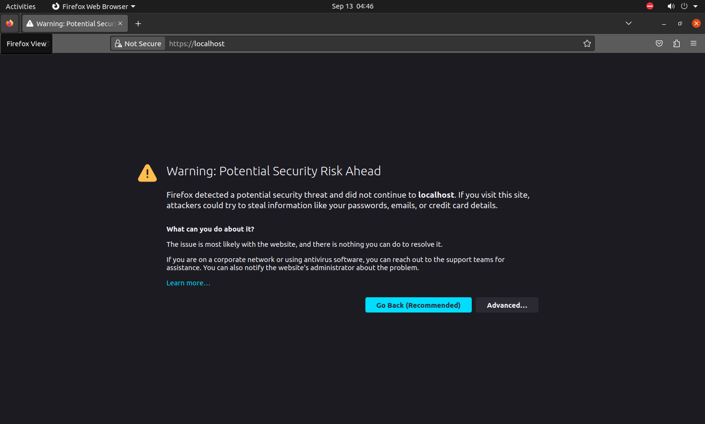

We accept the risk and continue from the advanced button, after all it is our service.
Then we enter the admin and password that we got from the installer earlier to login.
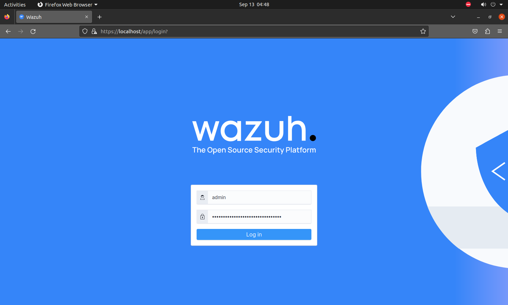

We should change the password after the first login.
After we login wazuh checks if there are any errors in the initialization.
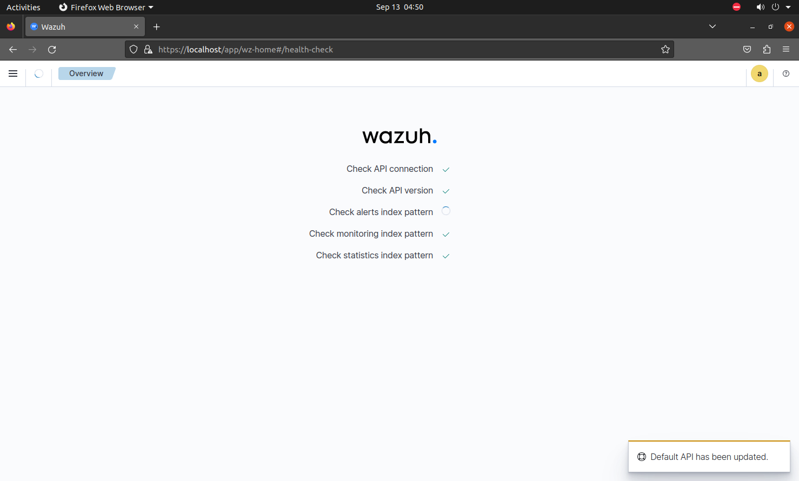

Then we are taken to the overview page, where we can see an overview of most of the main functionality of this SIEM software
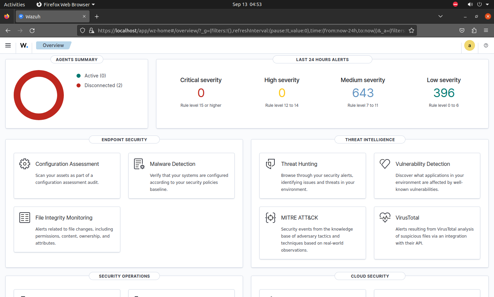

### Configuring the dashboards and alerts for real time threat detection
#### Creating a simple dashboard
Navigate to the explore tab through the sidebar and click on dashboard
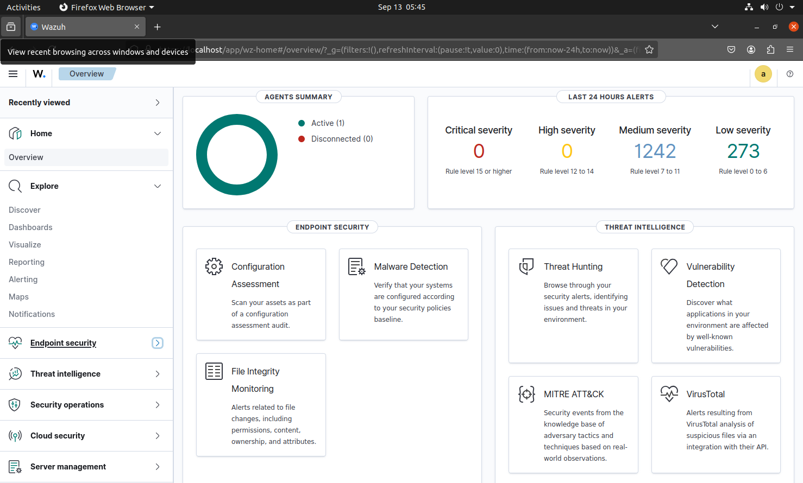

Click create new to add objects to the dashboard as needed

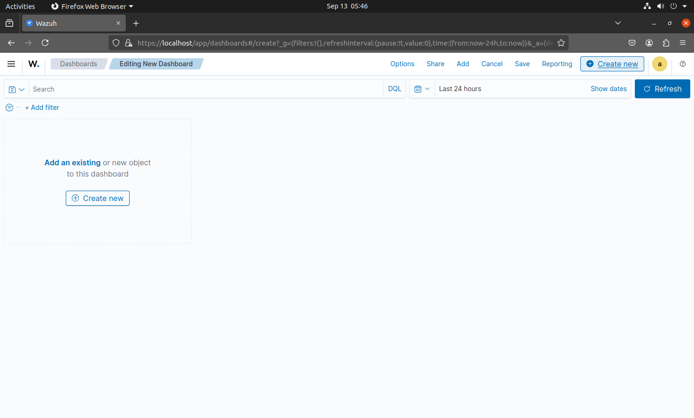

I will be creating a simple dashboad containing some of the vulnerabilities currently in my agents, agents resource usage and active agents
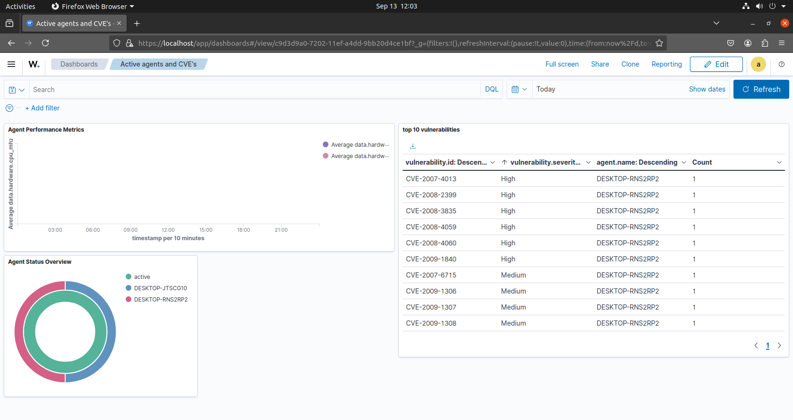

#### Setting up alerts

1. Navigate to Notifications tab to set up our alerting notification(mail/slack/etc).
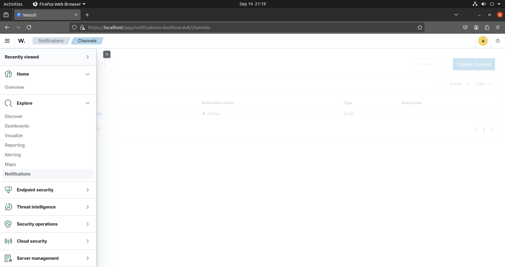

2. I have setup an email notifier 
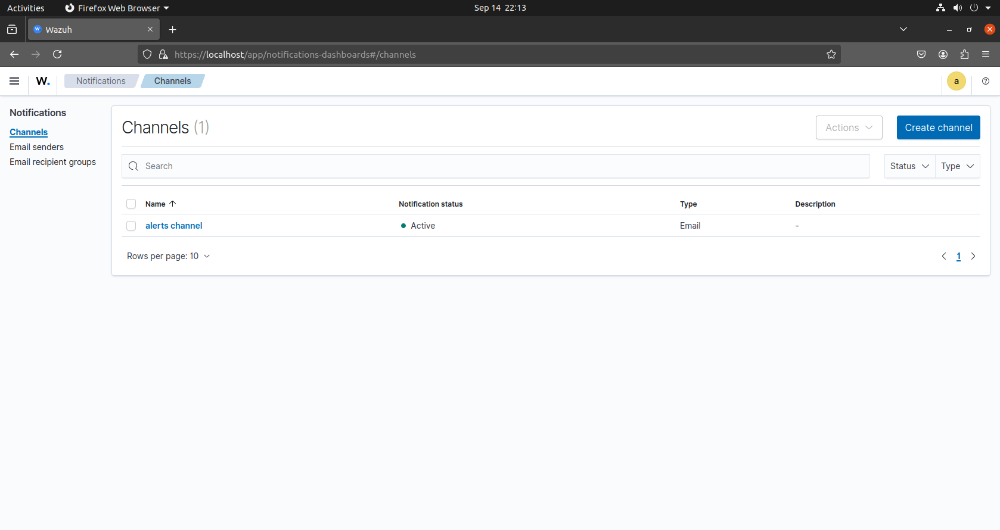

3. Then we go to the alerts tab
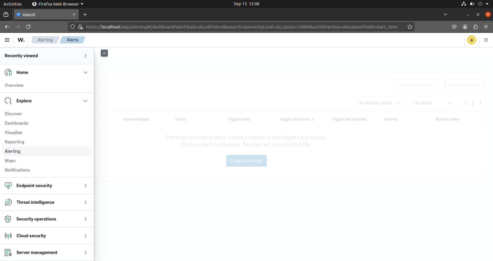

4. In the monitoring tab, we can create a job that monitors a certain condition, when met it will trigger the notification we just setup.
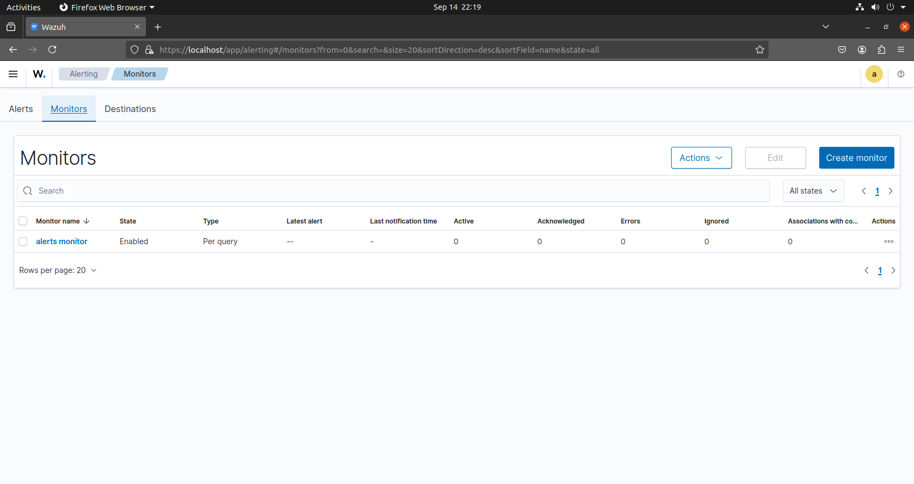

5. The condition for this monitoring job is security alerts like port scanning, unauthorized admin privilege's, unusual traffic at times of usually very low traffic like 2am, unusual resource usage and a lot more.
6. We can test the alerting system by triggering some triggers manually to check that the alerts are working as expected.

---
## Summary

**Summary:** This documentation provides a step-by-step guide for setting up and configuring the Wazuh SIEM on a Linux server. It covers everything from installing the Wazuh manager, configuring agents, and ensuring proper connectivity. The guide includes essential commands, troubleshooting tips, and key configurations to help you monitor and secure your systems effectively using Wazuh.


---
# **References**

[Wazuh Documentation](https://documentation.wazuh.com/current/index.html)
[Getting started](https://documentation.wazuh.com/current/getting-started/index.html)

